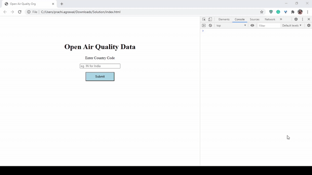

# Problem Statement

You have been provided with a public API by Open Air Quality Org, which gathers data about the quality of air through various data nodes, such as private and government agencies.

Following is the common URL to get the cities:

https://api.openaq.org/v1/cities

However, one can also look for the cities belonging to a given country by appending the following string at the end of the common URL:

"?country=nameOfCountry"

Thus, the URL will be updated to the following in case of getting cities for a given country:

https://api.openaq.org/v1/cities?country=IN

Here, IN represents the country India.

You've been provided with a form in your stub code. The submit button, when clicked, invokes the click handler named getCities while passing in the argument as the id of the input text box which is used for getting the country code.
You are required to complete the function getCities that makes a GET request to the above URL for getting all cities for a given country, the code for which is provided in the input box.
You can see the output in the Console tab in your browser's Developer Tools. The output will be in the following format:

Expected Output behaviour:

To know more about Open Air Quality Platform API, visit this link.

##### Additional Information:

1. The function name should be getCities
2. You should use Fetch to make the API request.
3. You should return a Promise from this function based on the API response.
4. The promise should be resolved by returning the API response in JSON if the response is a success.
5. Promise should be rejected by returning the JSON {error: "Failed to GET cities for <country-value>"} if API returns a failure response.
6. <country-value> should be replaced with the country code entered by the user in the form.

##### Notes:

1. The required HTML and CSS code is given to you.
2. Write your code inside index.js
3. Follow the TODOs given in the stub code
4. Observe the given stub code carefully.